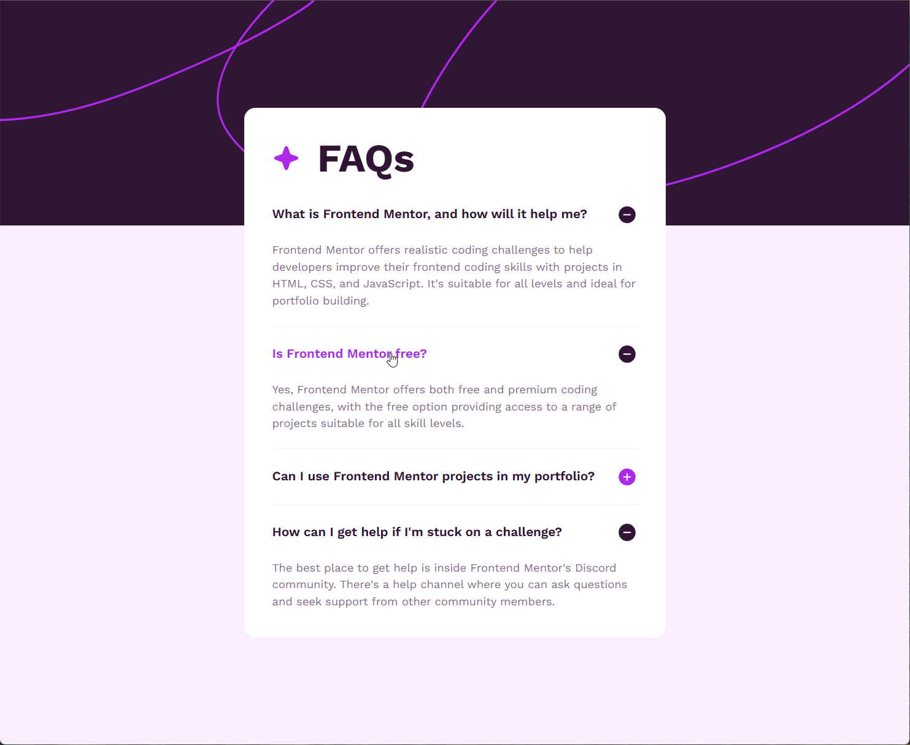

# JeffLangTech - Recipe page solution

This is a solution to the [FAQ accordion card challenge on Frontend Mentor](https://www.frontendmentor.io/challenges/faq-accordion-wyfFdeBwBz). 

## Table of contents

- [Overview](#overview)
  - [The challenge](#the-challenge)
  - [Preview](#preview)
  - [Links](#links)
- [My process](#my-process)
  - [Built with](#built-with)
  - [Step by step](#step-by-step)
  - [Continued development](#continued-development)
  - [Useful resources](#useful-resources)
- [Author](#author)

## Overview

### Preview



### Links

- Solution URL: [FrontEnd Mentor Solution](https://www.frontendmentor.io/solutions/css-grid-with-html-templates-and-json-data-loading-D0dMwlJPSb)
- Live Site URL: [Github](https://jefflangtech.github.io/recipe-card/)

## My process

### Built with

- Semantic HTML5 markup
- CSS custom properties
- CSS Grid
- CSS only accordion

### Step by step

This time I built small to big, starting with the accordion components, using the details element to provide the open/close functionality. 

Here's my basic component:
```html
<article class="faq-accordion">
  <details>
    <summary class="text-title"><h2>Can I use Frontend Mentor projects in my portfolio?</h2></summary>
    <p>Yes, you can use projects completed on Frontend Mentor in your portfolio. It's an excellent way to showcase your skills to potential employers!</p>
  </details>
</article>
```
I did try to make it as modular as possible without relying on JS at all. So that meant in my CSS I was using custom variables as well as inheritance from some of the outer structures. One way that the inner part of the details component is adjustable is that the header can be anything from an h2 to an h6 without altering the styling, and this means that it could, theoretically, fit in a larger page with a different heading hierarchy.

Here are the important parts of my CSS:
```css
.faq-accordion {
  summary {
    list-style: none;
    cursor: pointer;
    &>:is(h2, h3, h4, h5, h6) {
      font-size: inherit;
      font-weight: inherit;
    }
    &:hover {
      color: var(--primary-heading-accent);
    }
    &::after {
      content: var(--marker-img-closed);
      display: inline-block;
      width: 30px;
      height: 30px;
      margin-left: 1rem;
    }
    [open] &::after {
      content: var(--marker-img-opened);
    }
  }
}
```
Note: I should have used rems, not px, on the size of the marker image 🤷‍♂️

### Continued development

Next version I'm making the same thing but with hidden radio inputs so that I can have the open accordion component close when a different one is opened up.

### Useful resources

Just asking GPT lots of questions about what I can and cannot do with the details element. It has some specific functionality but then also some flexibility as long as you are willing to work within it's constraints.

## Author

- Website - [JeffLangTech](https://jefflangtech.github.io/)
- Frontend Mentor - [@jefflangtech](https://www.frontendmentor.io/profile/jefflangtech)